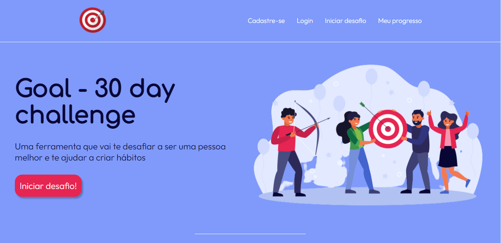
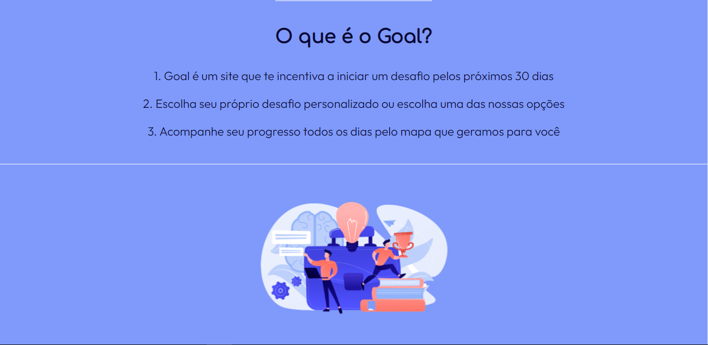

# Goal - 30 day challenge

 

## Um pouco sobre o projeto

---

A ideia surgiu a partir da minha busca pessoal por criação de hábitos somado a um vídeo que assisti, chamado "Try something new for 30 days", de Matt Cutts. 

A ideia da aplicação é permitir que o usuário acompanhe seu desempenho durante os 30 dias. O desafio pode ser registrado pelo próprio usuário ou pode ser escolhido a partir de opções já registradas.

<strong>**O projeto está aberto a contribuições.</strong>

## Tecnologias utilizadas

---

- HTML
- CSS
- JS

## Andamento

---

Em desenvolvimento...

